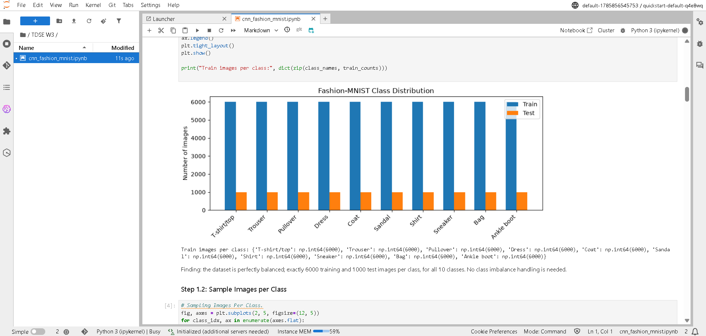

# Fashion-MNIST Classification — CNN Architecture Design and Analysis
 
Author - Julian Santiago Ramirez Urueña.
 
This project designs, justifies, and evaluates a convolutional neural
network for image classification on Fashion-MNIST, framed as an
architecture-design exercise rather than a hyperparameter search. It
covers exploratory data analysis, a non-convolutional baseline, a CNN
designed from scratch with an explicit justification for every
architectural choice, a controlled experiment on kernel size, an
interpretation of why convolution helps, and model training/deployment on
Amazon SageMaker.
 
## Dataset
 
Fashion-MNIST, loaded via `keras.datasets.fashion_mnist`: 60,000 training
images and 10,000 test images, 28×28 grayscale, split across 10 perfectly
balanced classes (6,000/1,000 images per class respectively). Chosen
because it is image-based, has more visual structure than digit-MNIST
(making the baseline-vs-CNN gap meaningful), and fits comfortably in
memory on a laptop.
 
Preprocessing: pixel values normalized to [0, 1]; a channel dimension
added, reshaping each image from (28, 28) to (28, 28, 1).
 
## Requirements
 
- Python 3
- TensorFlow / Keras
- NumPy
- Pandas
- Matplotlib
- Jupyter
## How to Run
 
1. Clone this repository.
2. Install the dependencies: `pip install numpy pandas matplotlib tensorflow jupyter`.
3. Open `cnn_fashion_mnist.ipynb` in Jupyter and click on "run all".
## Main Result
 
A baseline non-convolutional model (`Flatten` + `Dense(128, relu)` +
`Dense(10, softmax)`, 101,770 parameters) reaches **≈86.69% test
accuracy** in 5 epochs. Its main limitation: `Flatten` destroys all 2D
spatial structure, so every weight is tied to one exact pixel position,
with no notion of translation invariance.
 
The CNN designed for this project — two convolutional blocks
(`Conv2D(16, 3×3, same, relu)` → `MaxPool 2×2` → `Conv2D(32, 3×3, same,
relu)` → `MaxPool 2×2`) followed by `Flatten` → `Dense(64, relu)` →
`Dense(10, softmax)`, 105,866 parameters — reaches **≈90.16% test
accuracy**, a ~3.5 percentage-point gain over the baseline with a
comparable parameter budget. The gain is attributed to a better inductive
bias (locality + weight sharing), not to added capacity.
 
## Architecture
 
Every architectural choice below was made deliberately rather than
copied, and is justified in full in the notebook.
 
```
Input (28×28×1)
      │
Conv2D(16 filters, 3×3, stride 1, padding "same", ReLU)
      │
MaxPooling2D(2×2)              → 28×28 → 14×14
      │
Conv2D(32 filters, 3×3, stride 1, padding "same", ReLU)
      │
MaxPooling2D(2×2)              → 14×14 → 7×7
      │
Flatten
      │
Dense(64, ReLU)
      │
Dense(10, Softmax)
```
 
| Decision | Choice | Justification |
|---|---|---|
| Depth | 2 conv blocks | Enough depth for 28×28 images; deeper is unnecessary for this resolution |
| Kernel size | 3×3 | Cheaper than 5×5; sufficient spatial context per layer (see experiment below) |
| Stride | 1 | Preserves resolution inside each conv layer; downsampling handled separately by pooling |
| Padding | "same" | Avoids shrinking feature maps from the convolution itself |
| Pooling | MaxPool 2×2 after each block | Adds small-translation invariance; reduces resolution 28→14→7 |
| Filters | 16 → 32 | Filter count doubles as spatial resolution shrinks, following standard CNN practice |
 
## Experimental Results
 
Controlled experiment: kernel size (3×3 vs 5×5), with every other setting
fixed (layers, stride, padding, activation, pooling, filters, optimizer,
epochs, batch size, seed).
 
| Kernel | Parameters | Test accuracy | Test loss | Train time |
|---|---|---|---|---|
| 3×3 | 105,866 | 0.9016 | 0.2850 | 42.0s |
| 5×5 | 114,314 | 0.9003 | 0.2843 | 52.1s |
 
The larger kernel does not improve accuracy — it is marginally worse —
while costing ~8% more parameters and ~24% more training time. This
supports stacking small (3×3) kernels over using larger ones directly:
after two 3×3 conv+pool blocks, the effective receptive field already
covers enough spatial context to distinguish Fashion-MNIST's 10 classes,
so a wider single kernel is redundant capacity rather than a better
inductive bias.
 
## Interpretation
 
**Why did convolutional layers outperform the baseline?** The CNN reached
≈90.2% test accuracy versus the baseline's ≈86.7%, with a similar
parameter count (105,866 vs 101,770). The gain comes from two mechanisms:
*local connectivity* (each filter looks at a small 3×3 neighborhood,
matching the fact that meaningful features in a clothing image — a sleeve
edge, a collar — are spatially close together, unlike the Dense
baseline, which must learn every pixel-pair relationship independently),
and *weight sharing* (the same filter slides across the whole image, so a
pattern learned in one location is detected everywhere else without being
relearned), which is also why the conv layers need far fewer parameters
(4,800) than the Dense layer's 100,480 pixel-specific weights while
extracting richer spatial features.
 
**What inductive bias does convolution introduce?** Convolution encodes
*locality* (nearby pixels are more likely to be jointly relevant than
far-apart ones) and *translation equivariance* (a pattern's identity does
not depend on where it appears in the image), with pooling adding a
further bias toward small-translation *invariance*. These assumptions are
true for natural images, which is why they help here — but they are
assumptions imposed by the architecture, not guarantees discovered from
data. The kernel-size experiment above is direct evidence of this: going
from 3×3 to 5×5 does not improve accuracy, because the receptive field
that matters is the one accumulated across stacked layers, not the size
of a single kernel.
 
**In what type of problems would convolution not be appropriate?**
Convolution stops helping when the data has no meaningful local/spatial
structure for nearby input positions to share — for example, tabular data
where columns are independent measurements in an arbitrary order (as in
the heart-disease dataset from a previous lab, where `age` next to
`chol` in a column ordering carries no meaning the way neighboring pixels
do). More precisely, the deciding factor is not "is this an image" but
"is there a meaningful notion of neighborhood in this data" — which is
why convolution generalizes beyond images (Conv1D for time series/audio,
graph neural networks for graph-structured data), while a dataset like
heart disease, with no such neighborhood between features, is a case
where imposing convolution could hurt by assuming a false locality.

## SageMaker Evidence

Training was executed inside a SageMaker Studio notebook (`cnn_fashion_mnist.ipynb`),
running the same architecture and EDA/baseline/CNN pipeline as the local notebook —
see screenshot below showing the notebook running with real output inside the
SageMaker Studio domain.



Endpoint deployment could not be completed. The AWS Academy account's SageMaker
environment (tested in both Studio and a classic Notebook Instance) has no outbound
network connectivity to AWS regional API endpoints
